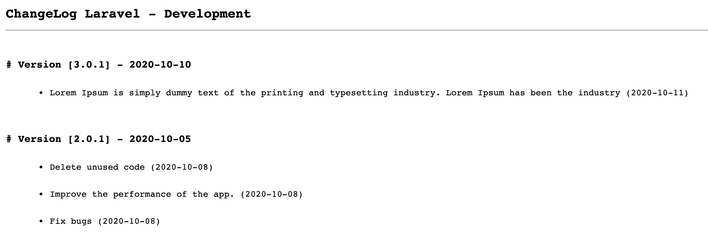
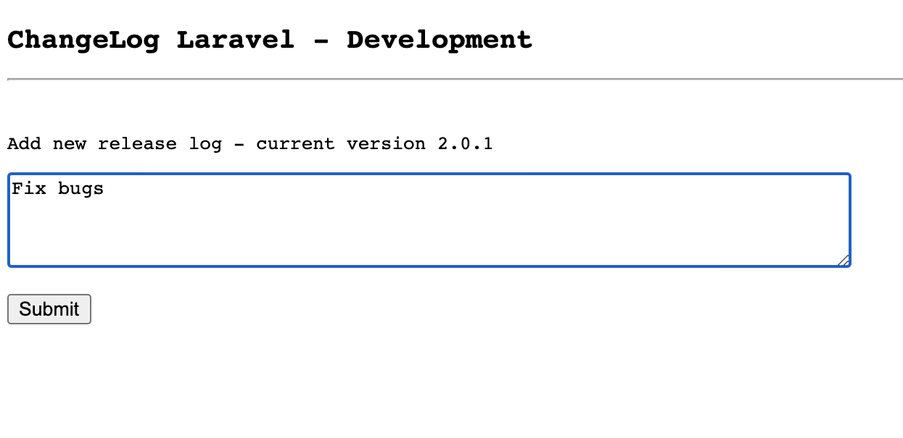

# Laravel ChangeLog
Add changelogs to your laravel project

This allow you to add changelogs to your laravel app, it will create a json file for each release and then merge them as and show them as html file.
The package provide also a simple form to create new log.






## Installation

You can install this package via composer using this command:

`composer require mohkoma/change-log`

## Usage

The package will automatically register itself.

You can publish the config-file and the views with:

`php artisan vendor:publish --provider="Mohkoma\ChangeLog\ChangeLogServiceProvider"`

you can create new log through the package route `/dev/changelog/create/` and you can show them through `/dev/changelog`.
Also you can get the data as json using `/dev/changelog/json`.

## Configuration

You can publish the config-file and the views with:

`php artisan vendor:publish --provider="Mohkoma\ChangeLog\ChangeLogServiceProvider"`

```php
<?php 

return [

    // Classify your changelogs by release date, start with oldest.
    'versions' => [
        '1.0.0' => '2020-10-01',
        '1.0.2' => '2020-10-06',
    ],

    // The name of your storage disk - better to be in the root of your project.
    'storage_disk' => 'changelog',

    // The folder name where your json files will be located.
    'directory_name'  => 'changelog',

    // The middleware of the routes
    'middleware' => [
        'read'  => ['web', 'auth', 'developer'],
        'write' => ['developer']
    ]
];
```